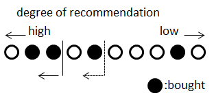
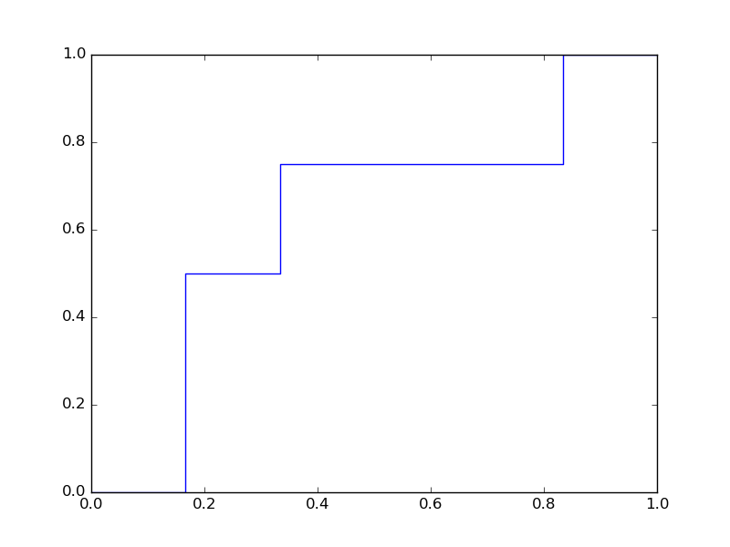
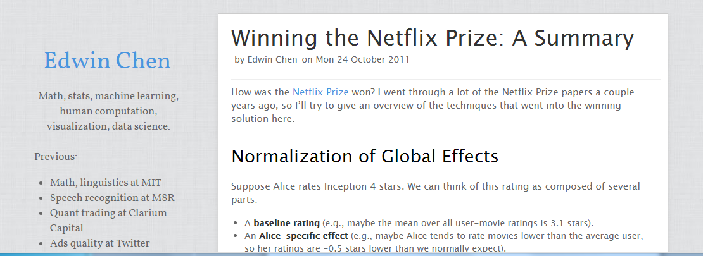
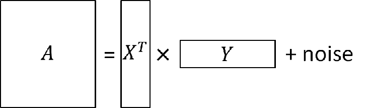

class:center,middle

## Introduction to Algorithms for Behavior Based Recommendation

### Tokyo Web Mining Meetup
### March 26, 2016
Kimikazu Kato

Silver Egg Technology Co., Ltd.

---
# About myself

加藤公一
Kimikazu Kato

Twitter: [@hamukazu](http://www.twitter.com/hamukazu)

LinkedIn: [http://linkedin.com/in/kimikazukato](http://linkedin.com/in/kimikazukato)

* Chief Scientist at Silver Egg Technology
* Ph.D in computer science, Master's degree in mathematics
* Experience in numerical computation and mathematical algorithms especially ...
    - Geometric computation, computer graphics
    - Partial differential equation, parallel computation, GPGPU
    - Mathematical programming
* Now specialize in
    - Machine learning, especially, recommendation system

---
# About our company

> Silver Egg Technology

> Established: 1998

> CEO: Tom Foley

> Main Service: Recommendation System, Online Advertisement

> Major Clients: [QVC](http://www.qvc.com/), Senshukai ([Bellemaison](http://www.bellemaison.jp/)), [Tsutaya](http://tsutaya.tsite.jp/)

We provide a recommendation system to Japan's leading web sites.

---
# Table of Contents
* Introduction
    - Types of recommendation
    - Evaluation metrics
* Algorithms
* Conclusion

---
# Caution

This presentation includes:
* State-of-the-art algorithms for recommendation systems,

But does NOT include:
* Any information about the core algorithm in Silver Egg Technology

---
# Recommendation System
> Recommender systems or recommendation systems (sometimes replacing "system" with a synonym such as platform or engine) are a subclass of information filtering system that seek to predict the 'rating' or 'preference' that user would give to an item. &mdash; Wikipedia

In this talk, we focus on collaborative filtering method, which only utilize users' behavior, activity, and preference.

Other methods include:
* Content-based methods
* Method using demographic data
* Hybrid

---
# Rating Prediction Problem

user\movie| W | X | Y | Z 
---|---|---|---|---
 A | 5 | 4 | 1 | 4 
 B | 4 |   |   |   
 C |   | 2 | 3 |   
 D | 1 |   | 4 | ?
 
Given rating information for some user/movie pairs,

Want to predict a rating for an unknown user/movie pair.

---
# Item Prediction Problem
user\item| W | X | Y | Z
---|---|---|---|---
 A | 1 | 1 | 1 | 1 
 B | 1 |   |   |   
 C |   | 1 |   |   
 D | 1 |?  | 1 | ?
 
Given "who bought what" information (user/item pairs),

Want to predict which item is likely to be bought by a user.

---
# Input/Output of the systems

### Rating Prediction
* Input: set of ratings for user/item pairs
* Output: map from user/item pair to predicted rating

### Item Prediction
* Input: set of user/item pairs as shopping data, integer `$k$`
* Output: top `$k$` items for each user which are most likely to be bought by him/her

---
# Evaluation Metrics for Recommendation Systems

### Rating prediction

* The Root of the Mean Squared Error (RMSE)
    - The square root of the sum of squared errors

### Item prediction

* Precision
    - (\# of Recommended and Purchased)/(\# of Recommended)
* Recall
    - (\# of Recommended and Purchased)/(\# of Purchased)
  

---
# RMSE of Rating Prediction

Some user/item pairs are randomly chosen to be hidden.

user\movie| W | X | Y | Z 
---|---|---|---|---
 A | 5 | 4 | 1 | 4 
 B | 4 |   |   |   
 C |   | 2 | 3 |   
 D | 1 |   | 4 | ?

Predicted as 3.1 but the actual is 4, then the squared error is `$|3.1-4|^2=0.9^2$`.

Take the sum over the error over all the hidden items and then, take the square root of it.
`\[\sqrt{\sum_{(u,i)\in \mathrm{hidden}} (\mathrm{predicted}_{ui}-\mathrm{actual}_{ui})^2}\]`

---
# Precision/Recall of Item Prediction

If three items are recommended:

* 2 out of 3 recommended items are actually bought: the precision is 2/3.
* 2 out of 4 bought items are recommended: the recall is 2/4.

These are denoted by recall@3 and prec@3.

Ex. recall@5 = 3/5, prec@5 = 3/4

---
# ROC and AUC

\# of recom.| 1| 2| 3| 4| 5| 6| 7| 8| 9|10
------------|--|--|--|--|--|--|--|--|--|--
\# of whites| 1| 1| 1| 2| 2| 3| 4| 5| 5| 6
\# of blacks| 0| 1| 2| 2| 3| 3| 3| 3| 4| 4

Divide the first and second row by total number of white and blacks respectively, and plot the values in xy plane.

---

This curve is called "ROC curve." The area under this curve is called "AUC."

Higher AUC is better (max =1).

The AUC is often used in academia, but for a practical purpose...

---
# Netflix Prize
> The Netflix Prize was an open competition for the best collaborative filtering algorithm to predict user ratings for films, based on previous ratings without any other information about the users or films, i.e. without the users or the films being identified except by numbers assigned for the contest. &mdash; Wikipedia

Shortly, an open competition for preference prediction.

Closed in 2009.

---
# Outline of Winner's Algorithm

Refer to the blog by E.Chen.

[http://blog.echen.me/2011/10/24/winning-the-netflix-prize-a-summary/](http://blog.echen.me/2011/10/24/winning-the-netflix-prize-a-summary/)

Digest of the methods:
* Neighborhood Method
* Matrix Factorization
* Restricted Boltzmann Machines
* Regression
* Regularization
* Ensemble Methods

---
# Notations
* Number of users: `$n$`
* Set of users: `$U=\left\{1,2,\ldots,n\right\}$`
* Number of items (movies): `$m$`
* Set of items (movies): `$I=\left\{1,2,\ldots,m\right\}$`
* Input matrix: `$A$` ($n \times m$ matrix)

---
# Matrix Factorization
* Based on the assumption that each item is described by a small number of latent factors
* Each rating is expressed as a linear combination of the latent factors
* Achieve good performance in Netflix Prize

`$$A \approx X^T Y$$`

Find such matrices `$X \in \mathrm{Mat}(f,n)$`, `$Y \in \mathrm{Mat}(f,m)$`
where `$f \ll n,m$`

---

`$$p\left (A | X, Y, \sigma \right) = \prod_{a_{ui}\neq 0}
\mathcal{N} \left( A_{ui} | X_u^T Y_i, \sigma \right)$$`
`$$p( X | \sigma_X ) = \prod_u \mathcal{N} (X_u | 0,\sigma_X I)$$`
`$$p( Y | \sigma_Y ) = \prod_i \mathcal{N} (Y_i | 0,\sigma_Y I)$$`

Find `$X$` and `$Y$` maximize `$p\left( X,Y | A,\sigma \right)$`
---

According to Bayes' Theorem,
`$$
\begin{align}
&p\left( X,Y | A,\sigma \right)\\
&= p(A| X,Y,\sigma) p(X|\sigma_X) p(X|\sigma_X)\times \mathrm{const.}
\end{align}
$$`

Thus,

`$$
\begin{align}
&\log p \left(U,V|A,\sigma, \sigma_U, \sigma_V \right)\\
&=\sum_{A_{ui}} \left( A_{ui} - X_u^T Y_i \right)^2 + 
\lambda_X \Vert X \Vert_\mathrm{Fro}^2 + \lambda_Y \Vert Y \Vert_\mathrm{Fro}^2 + \mathrm{const.}
\end{align}
$$`

where `$\Vert \cdot \Vert_\mathrm{Fro}$` means Frobenius norm.

How can this be computed? Use MCMC. See [Salakhutdinov et al., 2008].

Once `$X$` and `$Y$` are determined, `$\tilde{A}:=X^T Y$` and the prediction for `$A_{ui}$` is estimated by `$\tilde{A}_{ui}$`

---
# Difference between Rating and Shopping

.left-column[
Rating
user\movie| W | X | Y | Z 
---|---|---|---|---
 A | 5 | 4 | 1 | 4 
 B | 4 |   |   |   
 C |   | 2 | 3 |   
 D | 1 |   | 4 | ?

* Includes negative feedback
    - "1" means "boring"
* Zero means "unknown"
  

]
.right-column[
Shopping (Browsing)
user\item| W | X | Y | Z 
---|---|---|---|---
 A | 1 | 1 | 1 | 1 
 B | 1 |   |   |   
 C |   | 1 |   |   
 D | 1 |?  | 1 | ?

* Includes no negative feedback
* Zero means "unknown" or "negative"
* More degree of the freedom
]

Consequently, the algorithm effective for the rating matrix is not necessarily effective for the shopping matrix.

---
# Solutions
* Adding a constraint to the optimization problem
* Changing the objective function itself

---
# Adding a Constraint
* The problem has the too much degree of freedom
* Desirable characteristic is that many elements of the product should be zero.
* Assume that a certain ratio of zero elements of the input matrix remains zero after the optimization [Sindhwani et al., 2010]
    - Experimentally outperform the "zero-as-negative" method

---
# One-class Matrix Completion
[Sindhwani et al., 2010]

Introduced variables `$p_{ui}$` to relax the problem.

Minimize
`$$
\begin{align}
&\sum_{A_{ui}\neq 0} \left( A_{ui}- X_u^T Y_i \right) +
\lambda_X \Vert X \Vert_\mathrm{Fro}^2 +
\lambda_Y \Vert Y \Vert_\mathrm{Fro}^2 \\
&+\sum_{A_{ui}=0} \left[ p_{ui}(0-X_u^T Y_i)^2 + (1-p_{ui})(1-X_u^TY_i)^2\right]\\
&+T\sum_{A_{ui}=0} \left[ -p_{ui} \log p_{ui} - (1-p_{ui})\log (1-p_{ui}) \right]
\end{align}
$$`
subject to
`$$
\frac{1}{\vert \{ A_{ui} | A_{ui}=0 \}\vert} \sum_{A_{ui}=0} p_{ui}=r
$$`

---
`$$
\begin{align}
&\sum_{A_{ui}\neq 0} \left( A_{ui}- X_u^T Y_i \right) +
\lambda_X \Vert X \Vert_\mathrm{Fro}^2 +
\lambda_Y \Vert Y \Vert_\mathrm{Fro}^2 \\
&+\sum_{A_{ui}=0} \left[ p_{ui}(0-X_u^T Y_i)^2 + (1-p_{ui})(1-X_u^TY_i)^2\right]\\
&+T\sum_{A_{ui}=0} \left[ -p_{ui} \log p_{ui} - (1-p_{ui})\log (1-p_{ui}) \right]
\end{align}
$$`

### Intuitive explanation:

* `$p_{ui}$` means how likely the `$(u,i)$`-element is zero.
* The second term is the error of estimation considering `$p_{ui}$`'s.
* The third term is the entropy of the distribution.

---
## Implicit Sparseness constraint: SLIM (Elastic Net)

In the regression model, adding L1 term makes the solution sparse:
`$$
\min_w \Big[ \frac{1}{2n}\Vert Xw -y \Vert_2^2 +
\frac{\lambda (1-\rho)}{2}\Vert w \Vert_2^2 + \lambda \rho \vert w \vert_1 \Big]
$$`

The similar idea is used for the matrix factorization [Ning et al., 2011]:

Minimize
`$$ \Vert A-AW \Vert +
\frac{\lambda (1-\rho)}{2}\Vert W \Vert_\mathrm{Fro}^2 +
\lambda \rho \vert W \vert_1
$$`
subject to
`$$\mathrm{diag}\; W=0$$`

---
# Ranking prediction
* Another strategy of shopping prediction
* "Learn from the order" approach
* Predict whether X is more likely to be bought than Y, rather than the probability for X or Y.

---
# Bayesian Probabilistic Ranking
[Rendle et al., 2009]
* Consider matrix factorization model, but the update of elements is according to the observation of the "orders"
* The parameters are the same as usual matrix factorization, but the objective function is different

Consider a total order `$>_u$` for each `$u\in U$`. Suppose that `$i>_u j (i,j\in I)$` means "the user `$u$` is more likely to buy `$i$` than `$j$`.

The objective is to calculate `$p(i>_u j)$` such that `$A_{ui}=0$` and `$A_{uj}$` (which means `$i$` and `$j$` are not bought by `$u$`).

---
Let
`$$
D_A=\left\{(u,i,j)\in U\times I\times I \vert A_{ui}=1, A_{uj}=0 \right\},
$$`
and define
`$$ \prod_{u\in U} p(>_u | X,Y) :=
\prod_{(u,i,j)\in D_A} p(i>_u j|X,Y)$$`
where we assume
`$$
\begin{align}
p(i>_u j|X,Y) &= \sigma(X_u^T Y_i - X_u Y_j)\\
\sigma(x) &= \frac{1}{1+e^{-x}}
\end{align}
$$`
According to Bayes' theorem, the function to be optimized becomes:
`$$
\prod p(X,Y| >_u )=\prod p(>_u | X,Y) \times p(X)p(Y) \times \mathrm{const.}
$$`

---
Taking log of this,
`$$
\begin{align}
L&:=\log\left[\prod p(>_u \vert X,Y) \times p(X)p(Y)\right]\\
&=\log\prod_{(u,i,j)\in D_A} p(i>_u j|X,Y)-
\lambda_X\Vert X \Vert_\mathrm{Fro}^2 - \lambda_Y \Vert Y \Vert_\mathrm{Fro}^2\\
&=\sum_{(u,i,j)\in D_A} \log \sigma(X_u^T Y_i-X_u^T Y_j)-
\lambda_X\Vert X \Vert_\mathrm{Fro}^2 - \lambda_Y \Vert Y \Vert_\mathrm{Fro}^2
\end{align}
$$`

Now consider the following problem:
`$$
\max_{X,Y} \Bigl[
\sum_{(u,i,j)\in D_A} \log \sigma(X_u^T Y_i-X_u^T Y_j)-
\lambda_X\Vert X \Vert_\mathrm{Fro}^2 - \lambda_Y \Vert Y \Vert_\mathrm{Fro}^2
\Bigr]
$$`

This means "find a pair of matrices `$X,Y$` which preserve the order of the element of the input matrix for each `$u$`."

---
# Computation

The function we want to optimize:
`$$
\sum_{(u,i,j)\in D_A} \log \sigma(X_u^T Y_i-X_u^T Y_j)-
\lambda_X\Vert X \Vert_\mathrm{Fro}^2 - \lambda_Y \Vert Y \Vert_\mathrm{Fro}^2
$$`

`$U\times I \times I$` is huge, so in practice, a stochastic method is necessary.

Let the parameters be $\Theta=(X,Y)$.
 

The algorithm is the following:
> Repeat the following
> >  Choose `$(u,i,j) \in D_A$` randomly
> > > Update `$\Theta$` with `$\Theta = \Theta - \alpha \frac{\partial}{\partial \Theta} \left(\log \sigma(X_u^T Y_i-X_u^T Y_j)-
\lambda_X\Vert X \Vert_\mathrm{Fro}^2 - \lambda_Y \Vert Y \Vert_\mathrm{Fro}^2\right)$`

This method  is called Stochastic Gradient Descent (SGD).

---
# MyMediaLite 

[http://www.mymedialite.net/](http://www.mymedialite.net/)

* Open source implemetation of recommendation systems
* Written in C\#
* Reasonable computation time
* Supports rating and item prediction

---
# Practical Aspect of Recommendation Problem
* Computational time
* Memory consumption
* How many services can be integrated in a server rack?
* Super high accuracy with a super computer is useless for real business

---
# Concluding Remarks: What is Important for Good Prediction?
* Theory
    - Machine learning
    - Mathematical optimization
* Implementation
    - Algorithms
    - Computer architecture
    - Mathematics
* Human factors!
    - Hand tuning of parameters
    - Domain specific knowledge

---
# References (1/2)

### For beginers
* [比戸ら, データサイエンティスト養成読本 機械学習入門編, 技術評論社, 2016](http://bit.ly/yoseiml)
* [T.Segaran. Programming Collective Intelligence, O'Reilly Media, 2007.](http://shop.oreilly.com/product/9780596529321.do)
* [E.Chen. Winning the Netflix Prize: A Summary.](http://blog.echen.me/2011/10/24/winning-the-netflix-prize-a-summary/)
* A.Gunawardana and G.Shani. A Survey of Accuracy Evaluation Metrics of Recommendation Tasks, The Journal of Machine Learning Research, Volume 10, 2009.

---
# References (2/2)

### Papers
* Salakhutdinov, Ruslan, and Andriy Mnih. "Bayesian probabilistic matrix factorization using Markov chain Monte Carlo." Proceedings of the 25th international conference on Machine learning. ACM, 2008.
* Sindhwani, Vikas, et al. "One-class matrix completion with low-density factorizations." Data Mining (ICDM), 2010 IEEE 10th International Conference on. IEEE, 2010.
* Rendle, Steffen, et al. "BPR: Bayesian personalized ranking from implicit feedback." Proceedings of the Twenty-Fifth Conference on Uncertainty in Artificial Intelligence. AUAI Press, 2009.
* Zou, Hui, and Trevor Hastie. "Regularization and variable selection via the elastic net." Journal of the Royal Statistical Society: Series B (Statistical Methodology) 67.2 (2005): 301-320.
* Ning, Xia, and George Karypis. "SLIM: Sparse linear methods for top-n recommender systems." Data Mining (ICDM), 2011 IEEE 11th International Conference on. IEEE, 2011.
